Delta Model Summary
================
2026-08-24

# $\delta$ Model

## Overview

This Bayesian hierachical model studies neighboring competition’s effect
on focal tree growth and how this effect varies across species and focal
tree sizes. The model decomposes the effect of the neighborhood into a
component that is explained by shared evolutionary history (measured as
a phylogenetic correlation matrix) and the remaining component that is
unexplained by evolutionary history. Note that the model use to be named
the $\kappa$ model but then swithched to the $\delta$ model.

## Previous Model

The full stan implementation is available in
“analysis/mountrainier/tree_competition/kappa_model/singleSpModel.stan”

## Current Model Specification

### Parameters

#### Shared Parameters

- $\sigma$: standard deviation of log growth
- $\kappa$: exponent controlling how strongly phylogenetic similarity
  affects competition

#### Species-specific Parameters

For each focal species $s$:

- $y0_s$: baseline growth rate
- $\gamma_s$: scaling factor controlling effect of focal tree basal area
- $\beta_s$: strength of competition effect

#### Hyperparameters

- $\mu_{y0}$: the mean baseline growth on a log scale among all species
- $\tau_{y0}$: the sd of baseline growth on a log scale among all
  species
- $\mu_{\beta}$: the mean $\beta$ on a log scale among all species
- $\tau_{\beta}$: he sd of $\beta$ on a log scale among all species
- $\mu_{\gamma}$: the mean of the log odds of $\gamma$ among all species
- $\tau_{\gamma}$: the sd of the log odds of $\gamma$ among all species

### Likelihood

For each focal tree $i$:

$$
\log(y_i) \sim \text{Normal}(\mu_i, \sigma)
$$

where the expected log-growth is

$$
\mu_i = \log(y_0) + A_i - C_i
$$

### Available Resource Term

For each focal tree $i$ of species $s$:

$$
A_i = \gamma_s \cdot (log(ra_i)- log(ra_0))
$$

#### Input

$ra_i$: basal radius of the focal tree (\*10 cm) $ra_0$=2.5 baseline
basal radius to have meaningful interpretation of your parameter

### Neighboring Competition Term

For each focal tree $i$ of species $s$:

$$
C_i = \beta_s (B_i - BA_{compet0})
$$ $BA_{compet0}$=16 baseline neighboring competition

where the phylogenetically weighted basal area of neighbours is

$$
B_i = \sum_{j=a_i}^{b_i} b_{j} \cdot (corr_{ij})^k
$$

#### Input

$b_j$:basal area of neighboring species j $a_i$: start index of focal
tree i $b_i$: end index of focal tree i $corr_{ij}$:focal tree i’s
phylogenetic correlation with neighbors j

### Priors

#### Shared parameters

$$
\sigma \sim \text{Normal}\left(0, \frac{0.095}{2.57}\right)
$$

$$
k \sim \text{Beta}(2,2)
$$

#### Species Specific Parameters

$$
y0 \sim \text{LogNormal}(\mu_{y0},\tau_{y0})
$$ $$
\beta \sim \text{LogNormal}(\mu_{\beta},\tau_{\beta})
$$

$$
\text{logit}(\gamma_i)
\sim
\text{Normal}(\mu_{\gamma},\tau_{\gamma}).
$$

#### Hyperparameters

$$
\mu_{y0} \sim \text{Normal}(0.9,0.4)
$$

$$
\tau_{y0} \sim \text{Normal}^{+}(0,0.4)
$$ $$
\mu_{\beta} \sim \text{Normal}(-3.8,\text{log}(1.8))
$$ $$
\tau_{\beta} \sim \text{Normal}^{+}(0,\text{log}(1.3))
$$ $$
\mu_{\gamma} \sim \text{Normal}(0.67,0.9)
$$ $$
\tau_{\gamma} \sim \text{Normal}^{+}(0,0.1)
$$

### Implementation

The full stan implementation is available in
“analysis/mountrainier/tree_competition/kappa_model/deltamodel_multispecies.stan”

## Data Simulation Result

``` r
knitr::include_graphics(c("D:/ubc_study/udergrad_research/temporal ecology lab/climategrowthshifts/analysis/mountrainier/figures/deltamodeldatasimulation_1.png",
                          "D:/ubc_study/udergrad_research/temporal ecology lab/climategrowthshifts/analysis/mountrainier/figures/deltamodeldatasimulation_2.png",
                          "D:/ubc_study/udergrad_research/temporal ecology lab/climategrowthshifts/analysis/mountrainier/figures/deltamodeldatasimulation_3.png",
                          "D:/ubc_study/udergrad_research/temporal ecology lab/climategrowthshifts/analysis/mountrainier/figures/deltamodeldatasimulation_4.png",
                          "D:/ubc_study/udergrad_research/temporal ecology lab/climategrowthshifts/analysis/mountrainier/figures/deltamodeldatasimulation_5.png"))
```

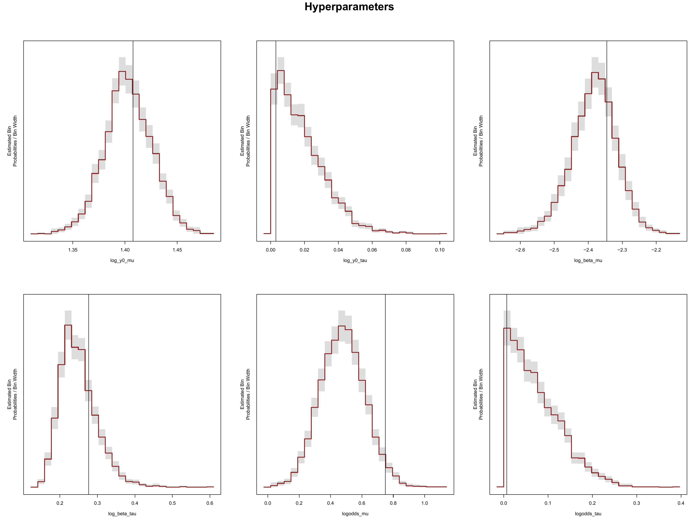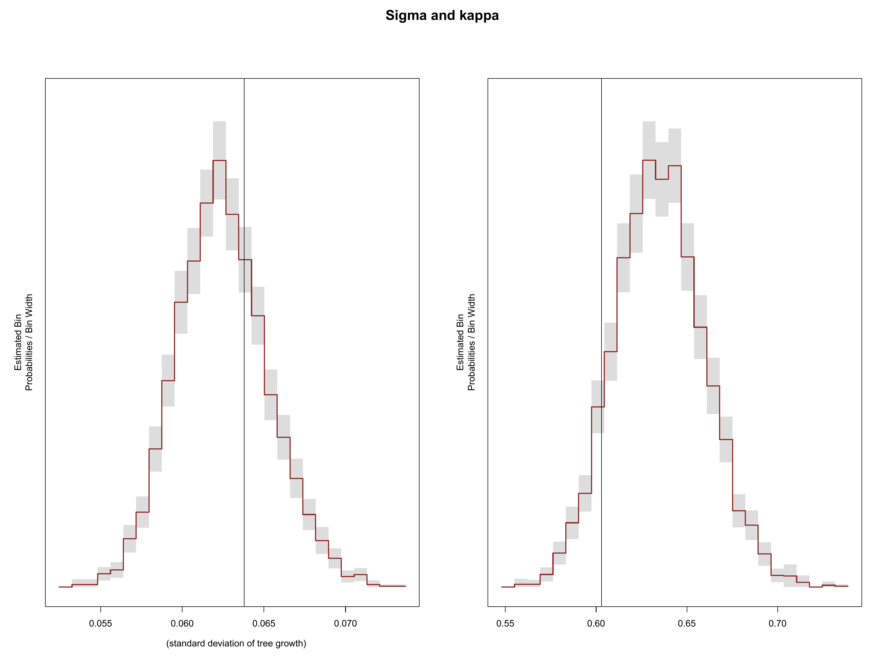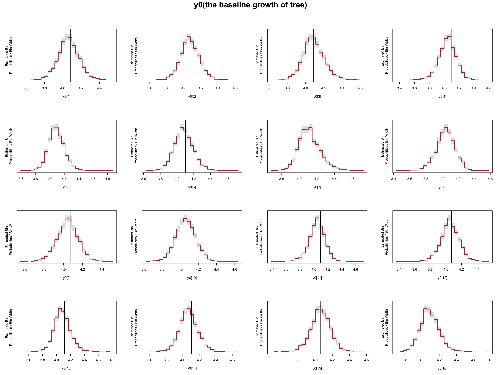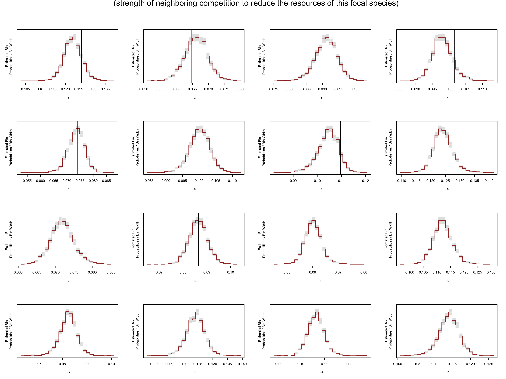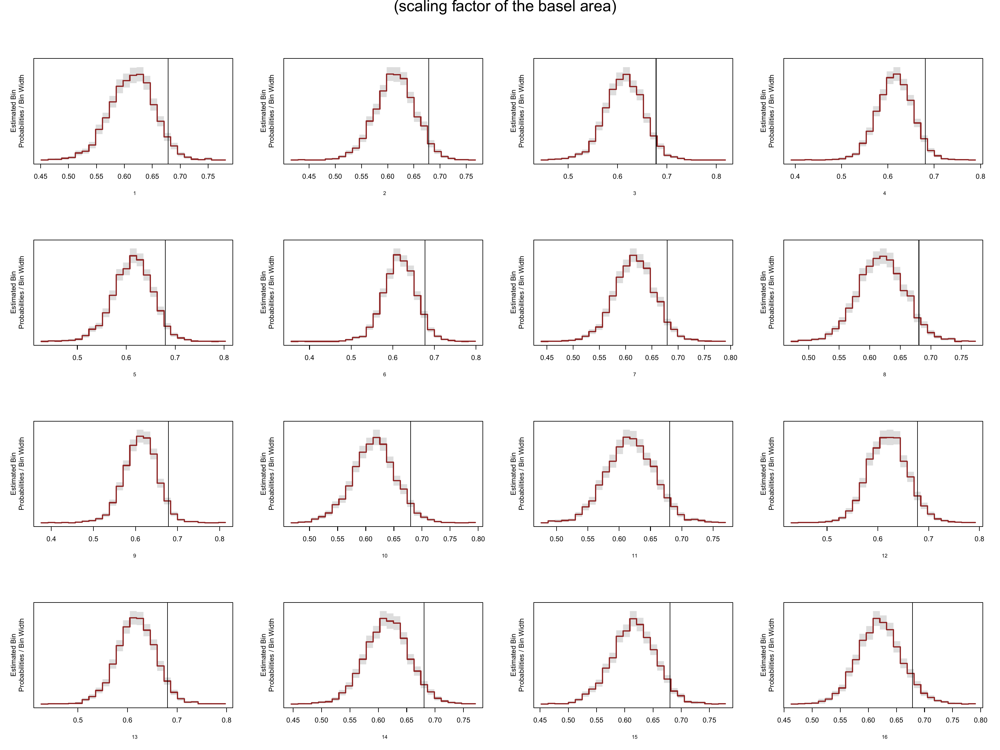

## Result

### Model fitted on 2008 data vs Model fitted on the average of the last five years (2004-2008) vs Model fitted on the average of the last three years (2006-2008)

``` r
knitr::include_graphics("D:/ubc_study/udergrad_research/temporal ecology lab/climategrowthshifts/analysis/mountrainier/figures/deltamodelresult_sigma.png")
```

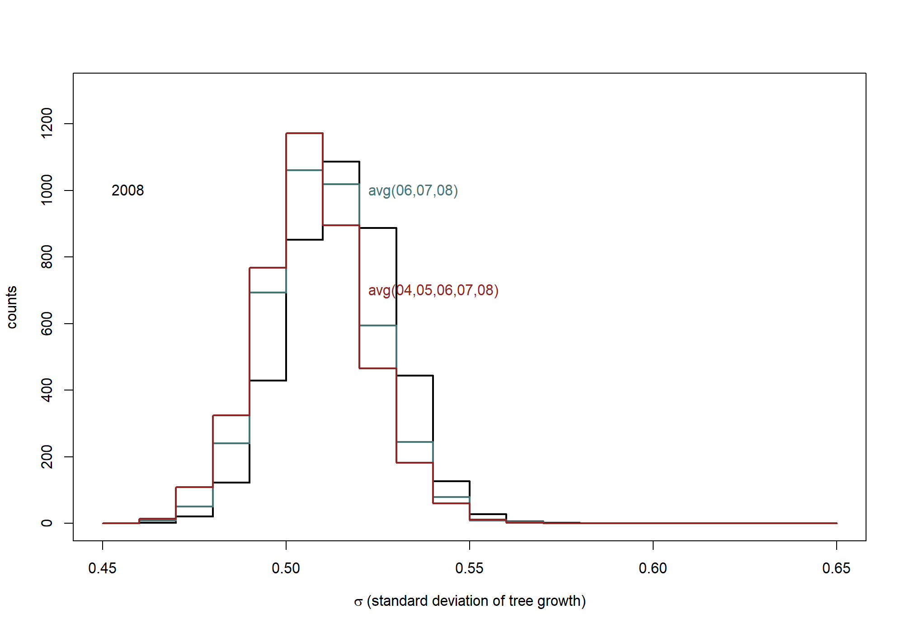

``` r
knitr::include_graphics("D:/ubc_study/udergrad_research/temporal ecology lab/climategrowthshifts/analysis/mountrainier/figures/deltamodelresult_kappa.png")
```

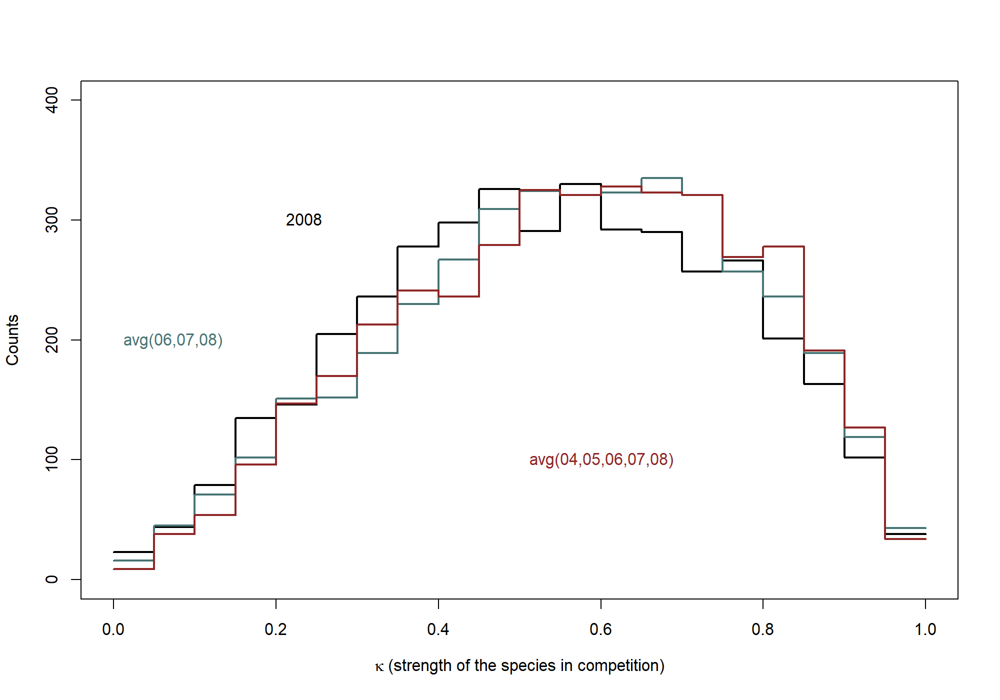

``` r
knitr::include_graphics("D:/ubc_study/udergrad_research/temporal ecology lab/climategrowthshifts/analysis/mountrainier/figures/deltamodelresult_y0.png")
```

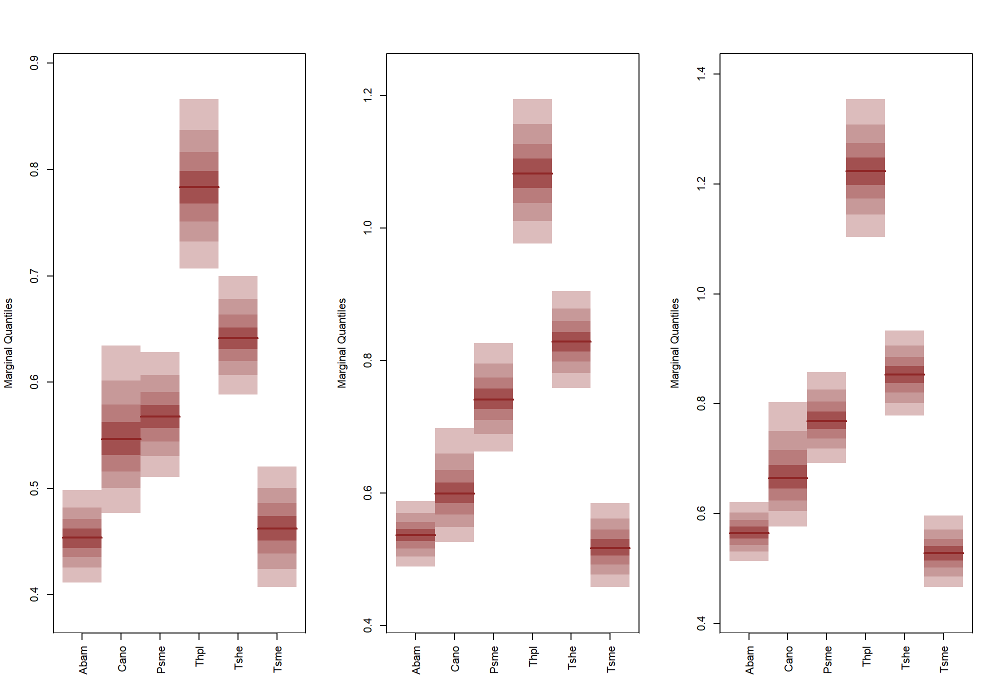

``` r
knitr::include_graphics("D:/ubc_study/udergrad_research/temporal ecology lab/climategrowthshifts/analysis/mountrainier/figures/deltamodelresult_beta.png")
```

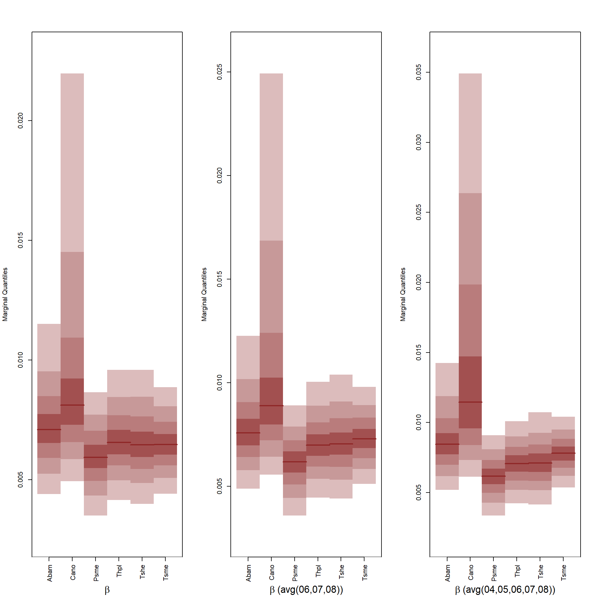

``` r
knitr::include_graphics("D:/ubc_study/udergrad_research/temporal ecology lab/climategrowthshifts/analysis/mountrainier/figures/deltamodelresult_gamma.png")
```

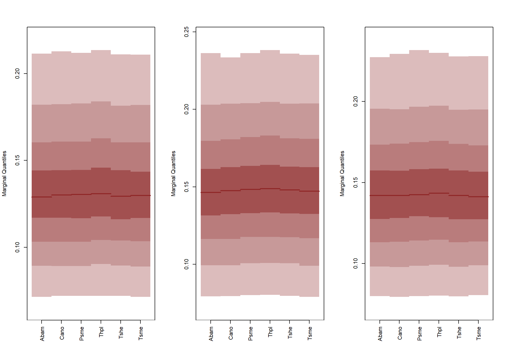

### Interpretation

Overall the estimates seem quite consistent.

I have the model run on the tree growth data in 2008, the average tree
growth from the last three years, and the average tree growth from the
last five years and the above visualizations compare the estimates of
the parameter. Roughly speaking, for parameters $\kappa$, $\sigma$, and
$\gamma$, the estimates from tree growth data in 2008, average tree
growth from the last three years, and average of the last five years are
quite close because their posterior distributions mostly overlap. This
consistency suggests that the inference for these parameters is not
strongly affected by short-term variation in tree growth around 2008.

In comparison, y0 and $\beta$ estimates are more sensitive to the tree
growth measurement window. Fitted on different tree growth data (2008,
avg3, and avg5), the centers of the y0 posterior distributions of all
species became different; the variance of y0\[1\] and y0\[4\] also
changed (the index represents the focal species). The center of the
posterior distributions of $\beta_1$ changed with the tree growth data
used, and so did the variances of $\beta_1$ and $\beta_2$. The centers
and variances of $\beta$ for the other species stayed roughly constant.

## Retrodictive Check

``` r
knitr::include_graphics(
  "D:/ubc_study/udergrad_research/temporal ecology lab/climategrowthshifts/analysis/mountrainier/figures/deltamodelretrocheck_treegrowth.png"
)
```

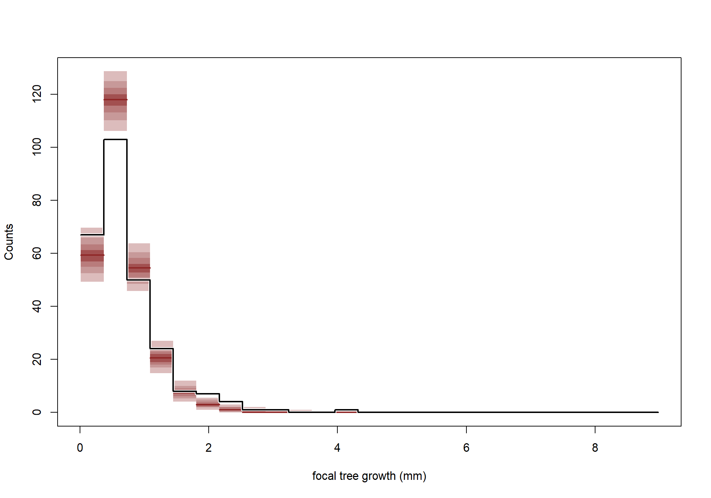

``` r
knitr::include_graphics(
  "D:/ubc_study/udergrad_research/temporal ecology lab/climategrowthshifts/analysis/mountrainier/figures/deltamodelretrocheck_species.png"
)
```

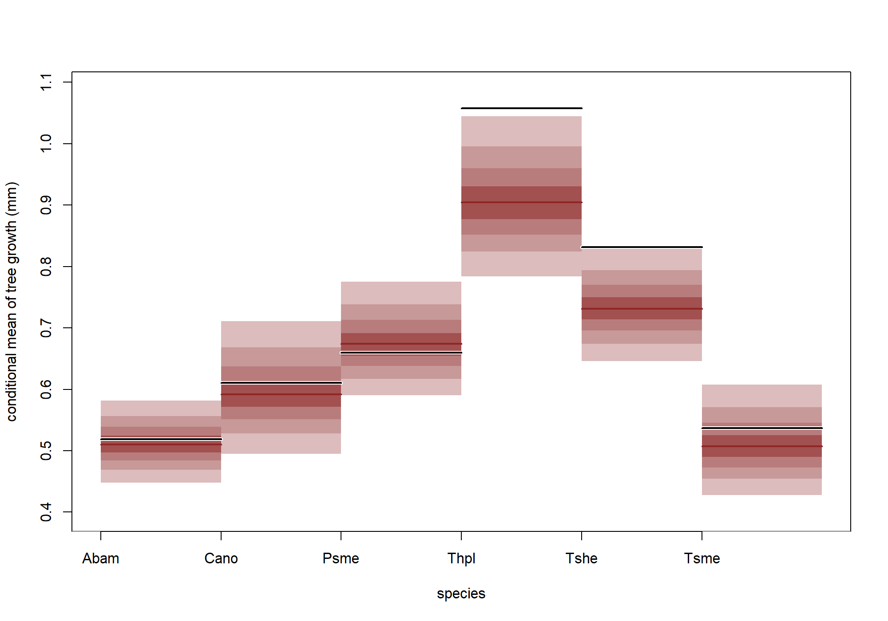

``` r
knitr::include_graphics(
  "D:/ubc_study/udergrad_research/temporal ecology lab/climategrowthshifts/analysis/mountrainier/figures/deltamodelretrocheck_treesize.png"
)
```

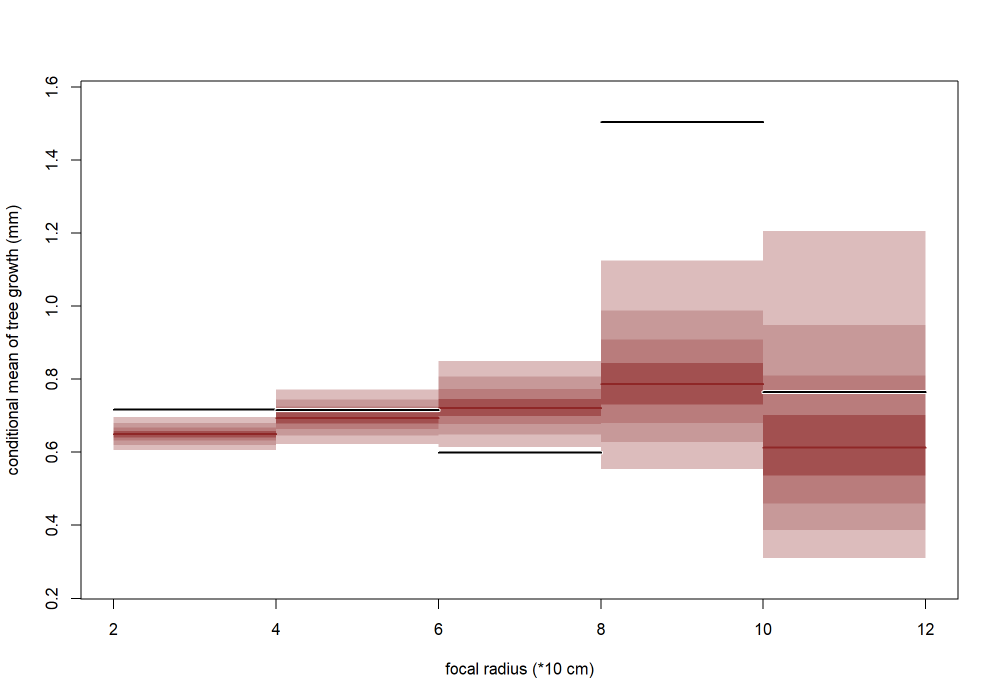

The model’s estimated mean growth for focal trees in the 80–100 cm size
range is far from the observed mean growth for this group. However, most
focal trees in the input data fall within the 20–80 cm range, with fewer
than 5 trees greater than 80 cm. Therefore, the observed mean growth for
the 80–100 cm group is based on a very small sample and may not be
representative to the population. We don’t consider this discrepancy a
major concern for our model assessment.

## Current Limitation and Next Step

Other than varying across species and focal tree sizes, the neighboring
competition effect can also vary across elevation. A next step for this
model is to run it on stand data from different elevation to see if the
parameter estimates vary, and to consider making them
elevation-specific.

## Files and Reproducibility

The main files used for model fitting and visualization are listed
below.

| File | Description |
|----|----|
| `analysis/mountrainier/tree_competition/kappa_model/singleSpModel.stan` | Stan implementation of the single species $\delta$ model. |
| `analysis/mountrainier/tree_competition/kappa_model/deltamodel_multispecies.stan` | Stan implementation of the current $\delta$ model. |
| `analysis/mountrainier/tree_competition/kappa_model/data/processedprocessed data/species_2008.csv` | Processed tree ring and neighborhood data |
| `analysis/mountrainier/tree_competition/kappa_model/data_sim.R` | fake data simulation |
| `analysis/mountrainier/tree_competition/kappa_model/confronting_with_real_data.R` | fits the model on existing tree growth data from mountrainier |
| `analysis/mountrainier/tree_competition/kappa_model/visualization.Rmd` | Generates posterior visualizations and model diagnostic plots. |
| `mcmc_analysis_tools_rstan.R` | Utility functions for posterior and MCMC analysis. |
| `mcmc_visualization_tools.R` | Utility functions used for posterior visualization. |
